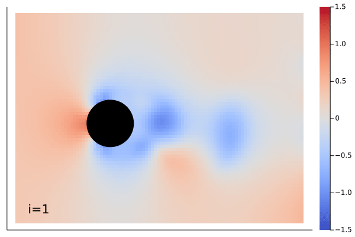

# NeuralOperators

| **Documentation** | **Build Status** |
|:-----------------:|:----------------:|
| [![doc stable badge]][doc stable link] | [![ci badge]][ci link] [![codecov badge]][codecov link] |

[doc stable badge]: https://img.shields.io/badge/docs-stable-blue.svg
[doc stable link]: http://neuraloperators.sciml.ai/stable/

[ci badge]: https://github.com/SciML/NeuralOperators.jl/actions/workflows/CI.yml/badge.svg
[ci link]: https://github.com/SciML/NeuralOperators.jl/actions/workflows/CI.yml
[codecov badge]: https://codecov.io/gh/foldfelis/NeuralOperators.jl/branch/master/graph/badge.svg?token=JQH3MP1Y9R
[codecov link]: https://codecov.io/gh/foldfelis/NeuralOperators.jl

| **Ground Truth** | **Inferenced** |
|:----------------:|:--------------:|
|  |  |

The demonstration showing above is Navier-Stokes equation learned by the `MarkovNeuralOperator` with only one time step information.
Example can be found in [`example/FlowOverCircle`](example/FlowOverCircle).

## Abstract

Neural operator is a novel deep learning architecture.
It learns a operator, which is a mapping between infinite-dimensional function spaces.
It can be used to resolve [partial differential equations (PDE)](https://en.wikipedia.org/wiki/Partial_differential_equation).
Instead of solving by finite element method, a PDE problem can be resolved by training a neural network to learn an operator mapping
from infinite-dimensional space (u, t) to infinite-dimensional space f(u, t).
Neural operator learns a continuous function between two continuous function spaces.
The kernel can be trained on different geometry, which is learned from a graph.

**Fourier neural operator** learns a neural operator with Dirichlet kernel to form a Fourier transformation.
It performs Fourier transformation across infinite-dimensional function spaces and learns better than neural operator.

**Markov neural operator** learns a neural operator with Fourier operators.
With only one time step information of learning, it can predict the following few steps with low loss
by linking the operators into a Markov chain.

Currently, the `FourierOperator` layer is provided in this work.
As for model, there are `FourierNeuralOperator` and `MarkovNeuralOperator` provided. Please take a glance at them [here](src/model.jl).

## Usage

```julia
model = Chain(
    # lift (d + 1)-dimensional vector field to n-dimensional vector field
    # here, d == 1 and n == 64
    Dense(2, 64),
    # map each hidden representation to the next by integral kernel operator
    FourierOperator(64=>64, (16, ), gelu),
    FourierOperator(64=>64, (16, ), gelu),
    FourierOperator(64=>64, (16, ), gelu),
    FourierOperator(64=>64, (16, )),
    # project back to the scalar field of interest space
    Dense(64, 128, gelu),
    Dense(128, 1),
    flatten
)
```

Or one can just call:

```julia
model = FourierNeuralOperator(
    ch=(2, 64, 64, 64, 64, 64, 128, 1),
    modes=(16, ),
    σ=gelu
)
```

And then train as a Flux model.

```julia
loss(𝐱, 𝐲) = sum(abs2, 𝐲 .- model(𝐱)) / size(𝐱)[end]
opt = Flux.Optimiser(WeightDecay(1f-4), Flux.ADAM(1f-3))
Flux.@epochs 50 Flux.train!(loss, params(model), data, opt)
```

## Examples

PDE training examples are provided in `example` folder.

### One-dimensional Fourier Neural Operator

[Burgers' equation](example/Burgers)

### Two-dimensional Fourier Neural Operator

[Double Pendulum](example/DoublePendulum)

### Markov Neural Operator

[Time dependent Navier-Stokes equation](example/FlowOverCircle)

### Super Resolution with MNO

[Super resolution on time dependent Navier-Stokes equation](example/SuperResolution)

## Roadmap

- [x] `FourierOperator` layer
- [x] One-dimensional Burgers' equation example
- [x] Two-dimensional with time Navier-Stokes equations example
- [x] `MarkovNeuralOperator` model
- [x] Flow over a circle prediction example
- [ ] `NeuralOperator` layer
- [ ] Poisson equation example

## References

- [Fourier Neural Operator for Parametric Partial Differential Equations](https://arxiv.org/abs/2010.08895)
  - [zongyi-li/fourier_neural_operator](https://github.com/zongyi-li/fourier_neural_operator)
- [Neural Operator: Graph Kernel Network for Partial Differential Equations](https://arxiv.org/abs/2003.03485)
  - [zongyi-li/graph-pde](https://github.com/zongyi-li/graph-pde)
- [Markov Neural Operators for Learning Chaotic Systems](https://arxiv.org/abs/2106.06898)
